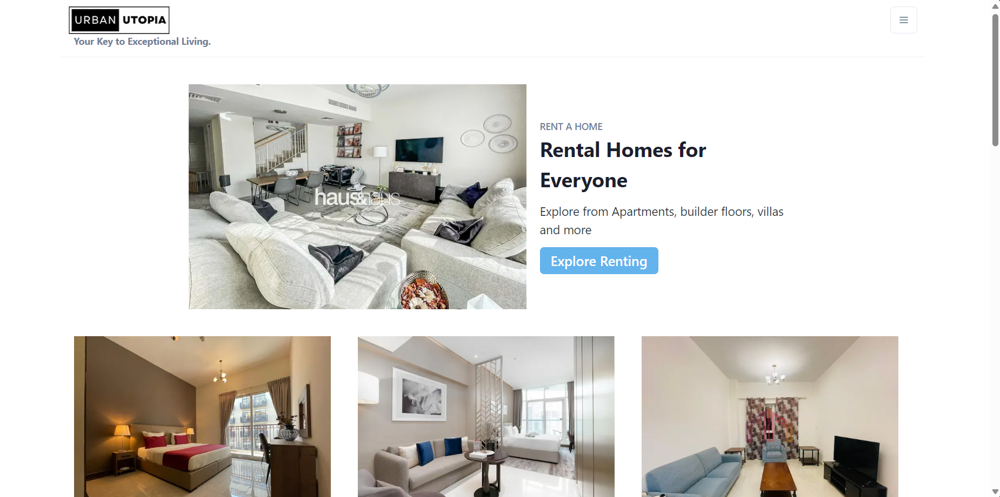
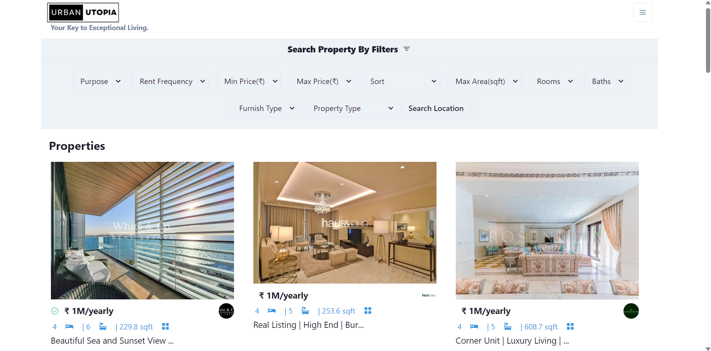

# UrbanUtopia: A RealEstate Web App

UrbanUtopia is an amazing Real Estate Application that offers a comprehensive platform for users to explore rental homes and for-sale properties. With advanced property filtering capabilities, detailed property listings, and an intuitive user interface, UrbanUtopia simplifies the process of finding the perfect home. The application leverages RapidAPI and BayutAPI to seamlessly integrate property data and provide users with accurate and up-to-date information.

This is a [Next.js](https://nextjs.org/) project bootstrapped with [`create-next-app`](https://github.com/vercel/next.js/tree/canary/packages/create-next-app).

## Getting Started

First, run the development server:

```bash
npm run dev
# or
yarn dev
# or
pnpm dev
# or
bun dev
```

Open [http://localhost:3000](http://localhost:3000) with your browser to see the result.

## Features
- Rental Homes and For-Sale Properties: UrbanUtopia showcases a diverse range of rental homes and for-sale properties to cater to different user needs.
  
  
  
- Advanced Property Filtering: Users can easily refine their property search using advanced filtering options such as location, type, price range, and amenities.
  
- 
  
- Property Details Page with Image Carousel: Each property listing includes a detailed property details page with an image carousel, allowing users to view the property from different angles.
- Responsive Design: UrbanUtopia features a responsive design that ensures a seamless user experience across various devices and screen sizes.

## Dependencies
- Next.js: Framework for building React applications.
- Chakra UI: Component library for building accessible and responsive UIs.
- NProgress: Library for displaying loading progress bar during page transitions.
- RapidAPI: Platform for accessing a wide range of APIs.
- BayutAPI: API for fetching real estate property data.
